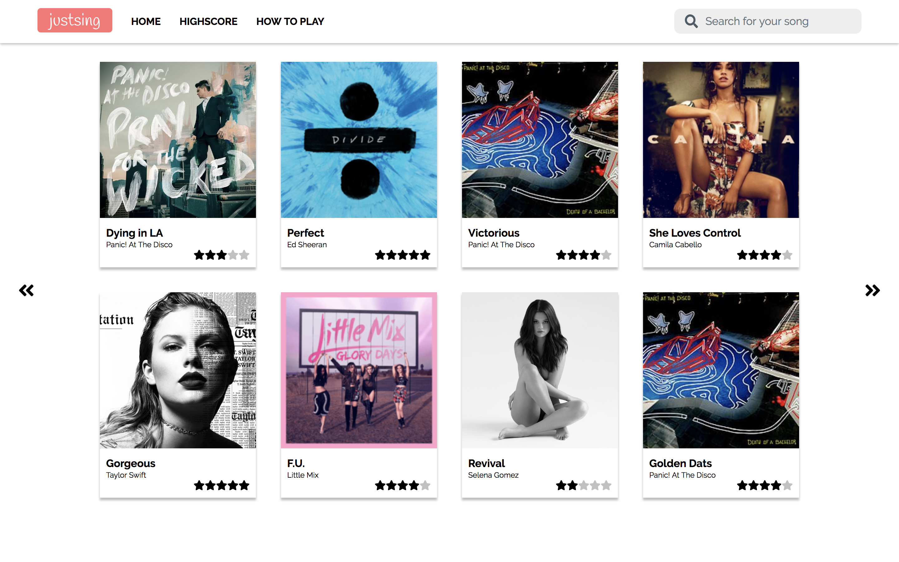

# just-sing
This was just supposed to be a simple side project for me to get familiar with the Vue framework, and I think I've pretty much got the hang of it. Here's a picture of what it looks like right now, it's just a scrolling list of songs with like ratings and stuff. 



## Client
### Project setup
```
npm install
```

### Compiles and hot-reloads for development
```
npm run serve
```

### Compiles and minifies for production
```
npm run build
```

### Lints and fixes files
```
npm run lint
```
## Server
### Project setup
```
npm install
```

### Compiles and hot-reloads for development
```
npm run dev
```

### Compiles and minifies for production
```
npm run build
npm run start
```

### Lints and fixes files
```
npm run test
```


